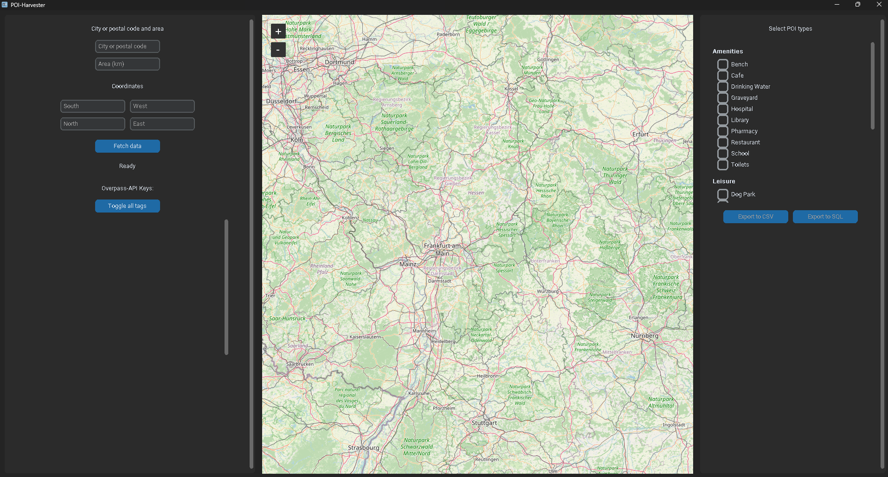
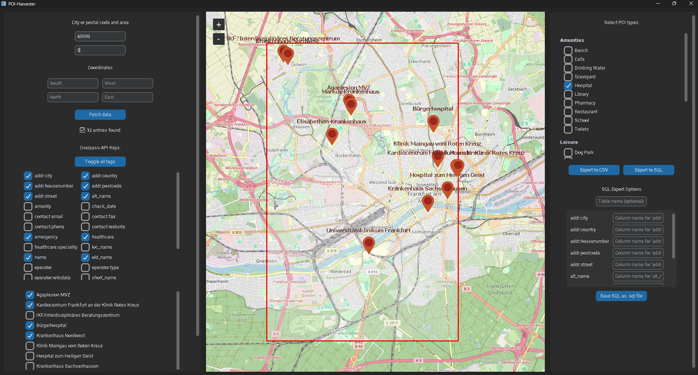

# POI-Harvester 🗺️🧭

An open-source tool for collecting, visualizing, and exporting Points of Interest (POIs) based on OpenStreetMap data. Supports CSV and SQL export — available both as a desktop application (`.exe`) and in the near future as a web app.



---

## 📚 Table of Contents

- [Features](#features)
- [Demo & Web App](#demo--web-app)
- [Download](#download)
- [Installation (Source)](#installation-source)
- [Installation (.exe)](#installation-exe)
- [Usage](#usage)
- [License](#license)
- [Credits & Data Source](#credits--data-source)

---

## Features

- Interactive map view powered by [TkinterMapView](https://github.com/TomSchimansky/TkinterMapView)
- Location search using geocoding
- Query building via Overpass API
- Selectable POI types and Overpass tags
- Dynamic CSV and SQL export functionality
- Customizable column mapping for SQL exports
- `.sql` file generation with full `CREATE TABLE` and `INSERT` statements
- Filterable tag list with toggle-all option
- Modern GUI using [customtkinter](https://github.com/TomSchimansky/CustomTkinter)

---

## Demo & Web App

You can try the poi-harvester live at:

**[POI-Harvester Web](https://poi-harvester.lpj.app/)**

---

## Download

The latest `.exe` release is available via GitHub Releases:

**[Download POI-Harvester.exe](https://github.com/lpj-app/poi-harvester/releases/latest)**

---

## Installation (Source)

### Requirements

- Python 3.11+
- pip

### Steps

```bash
git clone https://github.com/lpj.app/poi-harvester.git
cd poi-harvester
pip install -r requirements.txt
python3 main.py
```

## Installation (.exe)
1. Download the .exe file [here]() 
2. Launch the application via double-click — no installation required

Notes:
- Internet connection is required (for Overpass API and map data)
- CSV and SQL files are saved locally via file dialogs

## Usage
1. Launch the application
2. Enter a city or coordinates + radius
3. Choose your desired POI types (e.g. amenity=cafe)
4. Click “Fetch data” 
5. Select which tags to include 
6. Export:
- CSV → via file dialog
- SQL → to SQLite or plain .sql script with table structure

**Extras:**
- Customize column names for SQL 
- Toggle all tags with one click 
- Open SQL export options with “Export to SQL”


## License

Source Code: [MIT License]() You’re free to use, modify, and distribute the code — with attribution.

Data Source: This tool uses data from [OpenStreetMap](https://www.openstreetmap.org/#map=6/51.33/10.45), accessed via the Overpass API. The data is licensed under the [Open Database License (ODbL)](https://opendatacommons.org/licenses/odbl/1-0/)

## Credits & Data Source
- Geospatial data: © OpenStreetMap contributors — ODbL
- API: [Overpass-API](https://overpass-api.de/)
- GUI: [customtkinter](https://github.com/TomSchimansky/CustomTkinter)
- Mapping: [TkinterMapView](https://github.com/TomSchimansky/TkinterMapView)
- Developed by: [lpj.app](https://github.com/lpj-app)