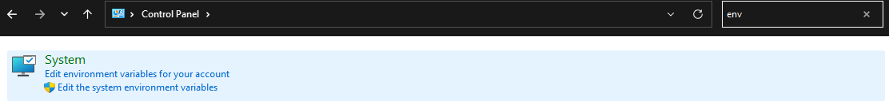
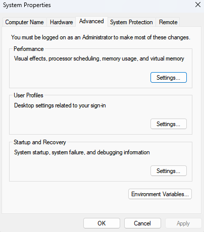
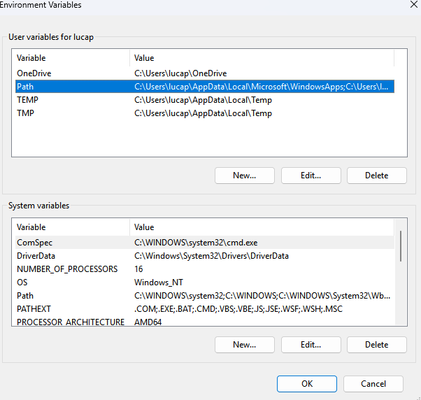
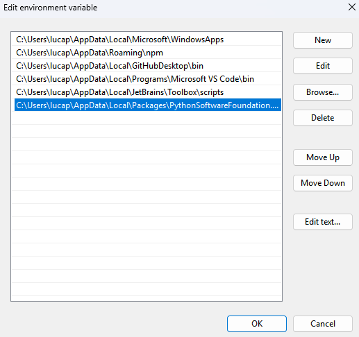
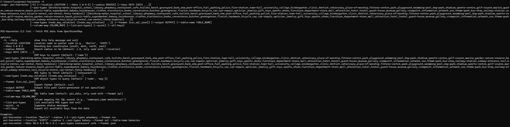

# POI-Harvester 🗺️🧭

An open-source tool for collecting, visualizing, and exporting Points of Interest (POIs) based on OpenStreetMap data.
Supports CSV and SQL export — available both as a desktop application (`.exe`) and in the near future as a web app.


---

## 📚 Table of Contents

- [Features](#features)
- [Demo & Web App](#demo--web-app)
- [Download](#download)
- [Requirements](#requirements)
- [Install and use Source-Code](#install-and-use-source-code)
  - [Steps](#steps)
- [Installation GUI (.exe)](#installation-gui-exe)
  - [GUI-Usage](#gui-usage)
- [Installation CLI](#installation-cli)
  - [1. Download the cli-setup](#1-download-the-cli-setup-zip-folder-from-here)
  - [2. Extract the folder](#2-extract-the-folder-and-cd-to-poi-harvester-cli-subfolder)
  - [3. Install the Package](#3-install-the-package)
  - [4. (Optional) Add Python Scripts Folder to PATH](#4-optional-add-python-scripts-folder-to-path)
  - [5. Verify the Installation](#5-verify-the-installation)
  - [CLI-Usage](#cli-usage)
    - [Syntax](#syntax)
    - [Required Parameters](#required-parameters)
    - [Optional Parameters](#optional-parameters)
    - [Supported POI Types](#supported-poi-types)
    - [Examples](#examples)
    - [Exporting POI Data](#exporting-poi-data)
      - [CSV Export (default)](#csv-export-default)
      - [SQL Export](#sql-export)
      - [JSON Export](#json-export)
      - [Custom Output Path](#custom-output-path)
      - [Exporting All Available Tags](#exporting-all-available-tags)
  - [Notes](#notes)
- [License](#license)
- [Credits & Data Source](#credits--data-source)


---
## Features

- Interactive map view powered by [TkinterMapView](https://github.com/TomSchimansky/TkinterMapView)
- Location search using geocoding
- Query building via Overpass API
- Selectable POI types and Overpass tags
- Dynamic CSV and SQL export functionality
- Customizable column mapping for SQL exports
- `.sql` file generation with full `CREATE TABLE` and `INSERT` statements
- Filterable tag list with toggle-all option
- Modern GUI using [customtkinter](https://github.com/TomSchimansky/CustomTkinter)

---

## Demo & Web App

You can try the poi-harvester live at:

**[POI-Harvester Web](https://poi-harvester.lpj.app/)**

---

## Download

The latest `.exe` release is available via GitHub Releases:

**[Download POI-Harvester.exe](https://github.com/lpj-app/poi-harvester/releases/latest)**

---

## Requirements

- Python 3.11+
- pip

## Install and use Source-Code

### Steps

```bash
git clone https://github.com/lpj.app/poi-harvester.git
cd poi-harvester
pip install -r requirements.txt
python3 main.py
```

## Installation GUI (.exe)

1. Download the .exe file [here](https://github.com/lpj-app/poi-harvester/releases/latest)
2. Launch the application via double-click — no installation required

Notes:

- Internet connection is required (for Overpass API and map data)
- CSV and SQL files are saved locally via file dialogs

### GUI-Usage

1. Launch the application
2. Enter a city or coordinates + radius
3. Choose your desired POI types (e.g. amenity=cafe)
4. Click “Fetch data”
5. Select which tags to include
6. Export:

- CSV → via file dialog
- SQL → to SQLite or plain .sql script with table structure

**Extras:**

- Customize column names for SQL
- Toggle all tags with one click
- Open SQL export options with “Export to SQL”

## Installation CLI

### 1. Download the cli-setup .zip folder from [here](https://github.com/lpj-app/poi-harvester/releases/latest)

### 2. Extract the folder and cd to poi-harvester-cli subfolder

### 3. Install the Package
Inside the folder, run:

```bash
pip install .
```

This will add poi-harvester to your python modules

### 4. (Optional) Add Python Scripts Folder to PATH

If the command poi-harvester is not recognized after installation, you may need to add your Python Scripts directory to
the system PATH manually:

1. Press `WIN + R`, then type:

```bash
%localappdata%
```

2. In the opened folder, go to: <br>
   `Packages → [Your Python folder, e.g., PythonSoftwareFoundation.Python.3.13_qbz5n2kfra8p0]` <br><br>

3. Navigate to and copy the path: <br>
   `\LocalCache\local-packages\Python313\Scripts` <br><br>

4. Open Control Panel and search for `env`, then click Edit the system environment variables
    <br><br>

5. In the **System Properties** window, click on **Environment Variables**
    <br><br>

6. Under **System Variables**, select `Path` and click **Edit**
    <br><br>

7. Click **New**, and paste the copied path
    <br><br>

8. Confirm all dialogs by clicking **OK** <br><br>

### 5. Verify the Installation

Open a new terminal and run:

```bash
poi-harvester -h
```

If installed correctly, the help message for the CLI tool should appear:


### CLI-Usage

#### Syntax

```
poi-harvester [-h] (--location LOCATION | --bbox S W N E) [--radius RADIUS] [--keys KEYS [KEYS ...]]
              [--poi-types {drinking-water,hospital,school,...}] 
              [--osm-types {node,way,relation} [...]] 
              [--format {csv,sql,json}] 
              [--output OUTPUT] 
              [--table-name TABLE_NAME] 
              [--column-map COLUMN_MAP] 
              [--list-poi-types] 
              [--quiet] 
              [--all-keys]
```

<br><br>

#### Required Parameters

- `--location LOCATION`: Name of a place or postal code (e.g. `"Berlin"` or `"63571"`)

OR

- `--bbox S W N E`: Define a bounding box via coordinates (South, West, North, East)

<br><br>

#### Optional Parameters

| Argument	            | Description                                                             |
|----------------------|-------------------------------------------------------------------------|
| `--radius RADIUS`    | Radius in kilometers (used only with --location, default: 1.0)          |
| `--poi-types`        | One or more POI categories (default: restaurant)                        |
| `--keys`             | Additional OSM keys to export (default: ['name'])                       |
| `--osm-types`        | OSM data types to query: node, way, relation (default: ['node', 'way']) |
| `--format FORMAT`    | Export format: csv, sql, or json (default: csv)                         |
| `--output OUTPUT   ` | Custom output file path                                                 |
| `--table-name NAME`  | Table name for SQL export (default: poi_data)                           |
| `--column-map MAP`   | Custom column mapping (e.g., name=poi_name website=url)                 |
| `--all-keys`         | Export all available OSM keys                                           |
| `--quiet, -q`        | Suppress console output                                                 |
| `--list-poi-types`   | Print all available POI types and exit                                  |
| `-h, --help`         | Show usage help and exit                                                |

<br><br>

#### Supported POI Types
A full list of available POI categories includes:
- `hospital`, `restaurant`, `school`, `bakery`, `fuel`, `toilets`, `museum`, `bus-stop`, `grocery`, `cafe`, `zoo`, and many more

To see the complete list, run:
```bash
poi-harvester --list-poi-types
```

<br><br>

#### Examples
Search by location and radius:
```bash
poi-harvester --location "Berlin" --radius 1.5 --poi-types pharmacy --format csv
```

<br>

Search by bounding box:
```bash
poi-harvester --bbox 50.0 8.0 50.1 8.1 --poi-types restaurant cafe --format json
```

<br>

Export to SQL with custom table name:
```bash
poi-harvester --location "63571" --radius 2 --poi-types bakery --format sql --table-name bakeries
```

<br><br>


#### Exporting POI Data

You can export POI data from OpenStreetMap in multiple formats using the `--format` flag. The available export formats are:

- `csv`: Default format — easy to read and import into spreadsheets or GIS tools
- `json`: Structured format — suitable for further processing in code or APIs
- `sql`: Structured SQL insert statements — ideal for database import

<br>

##### CSV Export (default)

```bash
poi-harvester --location "Berlin" --radius 2 --poi-types cafe --format csv
```
- The output is a `.csv` file with columns like `name`, `lat`, `lon`, and any extra keys you request with `--keys`.
- If no `--output` is given, the filename is generated automatically (e.g., `berlin_cafe.csv`).

<br>

##### SQL Export
```bash
poi-harvester --location "63571" --radius 2 --poi-types bakery --format sql --table-name bakeries
```

- This produces a SQL file containing `CREATE TABLE` and `INSERT INTO` statements. 
- Use `--column-map` to rename columns, e.g.:
```bash
--column-map "name=poi_name website=poi_website"
```

<br>

##### JSON Export

```bash
poi-harvester --bbox 50.0 8.0 50.1 8.1 --poi-types restaurant --format json
```
- The JSON format is hierarchical and mirrors the OSM structure, suitable for developers and APIs.

<br>

##### Custom Output Path

You can override the auto-generated output filename using the `--output` flag:
```bash
poi-harvester --location "Berlin" --poi-types pharmacy --format csv --output data/pharmacies_berlin.csv
```
Ensure the directory exists before running the command.

<br>

##### Exporting All Available Tags

Use `--all-keys` if you want to export all available OSM tags for the selected POIs:
```bash
poi-harvester --location "Frankfurt" --poi-types museum --all-keys --format json
```
This is useful when building rich datasets for analysis or visualization.

<br><br>

### Notes
- Output file names are auto-generated unless specified with `--output`. 
- Coordinate format for `--bbox` is: `SOUTH WEST NORTH EAST` (decimal degrees). 
- Data is sourced live from OpenStreetMap via Overpass API.


---

## License

Source Code: [MIT License]() You’re free to use, modify, and distribute the code — with attribution.

Data Source: This tool uses data from [OpenStreetMap](https://www.openstreetmap.org/#map=6/51.33/10.45), accessed via
the Overpass API. The data is licensed under
the [Open Database License (ODbL)](https://opendatacommons.org/licenses/odbl/1-0/)

## Credits & Data Source

- Geospatial data: © OpenStreetMap contributors — ODbL
- API: [Overpass-API](https://overpass-api.de/)
- GUI: [customtkinter](https://github.com/TomSchimansky/CustomTkinter)
- Mapping: [TkinterMapView](https://github.com/TomSchimansky/TkinterMapView)
- Developed by: [lpj.app](https://github.com/lpj-app)

© POI-Harvester - [lpj.app](https://github.com/lpj-app)